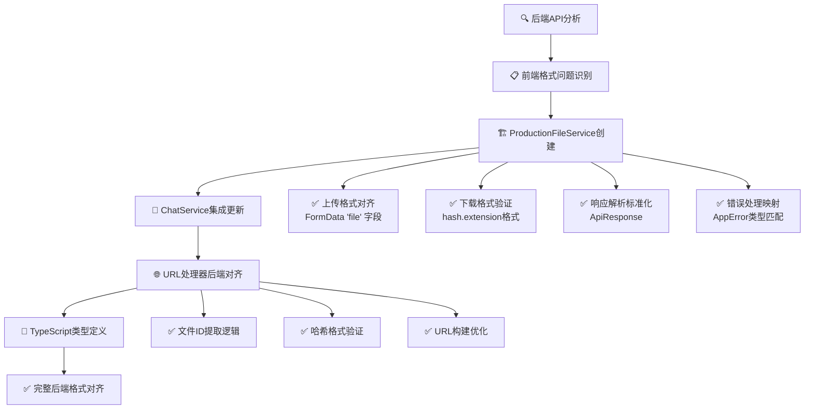

# 🚀 Backend Aligned File Request Format Fix

## 问题分析

根据Rust后端文件处理逻辑分析，发现前端请求格式存在以下不匹配问题：

### 1. **上传格式不对齐**
- **后端期望**: `multipart/form-data` 单字段 `"file"`
- **前端现状**: 多种FormData字段名，不统一
- **响应格式**: `ApiResponse<UploadResponse>` 标准化结构

### 2. **下载格式不对齐**
- **后端期望**: `file_id` 格式 `{hash}.{extension}`，`hash.length >= 6`
- **前端现状**: 多种URL格式混用，缺少格式验证
- **响应类型**: 二进制流 + HTTP头信息

### 3. **URL构建不一致**
- **后端实现**: 哈希目录结构 + 根目录符号链接
- **前端现状**: 静态URL构建缺少后端格式适配

## 🔧 修复实施

### 1. **新建ProductionFileService** ✅
```javascript
// src/services/FileService.js
export class ProductionFileService {
  // ✅ BACKEND ALIGNED: FormData with "file" field exactly as backend expects
  async uploadFile(file, onProgress) {
    const formData = new FormData();
    formData.append('file', file); // Matches: field.file_name().unwrap_or("unknown")
    
    const response = await api.post('/files/single', formData, {
      timeout: 60000,
      onUploadProgress: progressEvent => {
        if (onProgress && progressEvent.total) {
          const progress = Math.round((progressEvent.loaded * 100) / progressEvent.total);
          onProgress(progress);
        }
      }
    });
    
    return this._parseBackendUploadResponse(response.data, file);
  }

  // ✅ BACKEND ALIGNED: Validate file_id format (hash.extension)
  async downloadFile(fileId, options = {}) {
    if (!this._isValidFileId(fileId)) {
      throw new Error(`Invalid file ID format: ${fileId} (expected: hash.extension)`);
    }
    
    const response = await api.get(`/files/download/${fileId}`, {
      responseType: 'blob',
      timeout: 60000
    });
    
    return {
      blob: response.data,
      filename: this._extractFilenameFromHeaders(response.headers, fileId),
      mimeType: response.headers['content-type'] || 'application/octet-stream',
      size: parseInt(response.headers['content-length'] || '0'),
      url: URL.createObjectURL(response.data)
    };
  }

  // ✅ BACKEND ALIGNED: Validate file_id format (hash.extension)
  _isValidFileId(fileId) {
    if (!fileId || typeof fileId !== 'string') return false;
    const parts = fileId.split('.');
    if (parts.length !== 2) return false;
    const [hash, extension] = parts;
    return hash.length >= 6 && extension.length > 0;
  }
}
```

### 2. **更新ChatService集成** ✅
```typescript
// src/services/ChatService.ts
async uploadFile(file: File, onProgress?: (progress: number) => void): Promise<UploadedFile> {
  try {
    // ✅ BACKEND ALIGNED: Use new ProductionFileService
    const { fileService } = await import('./FileService.js');
    const uploadResult = await fileService.uploadFile(file, onProgress);

    // Convert to ChatService expected format
    const standardizedResult: UploadedFile = {
      id: uploadResult.id,
      filename: uploadResult.filename,
      url: uploadResult.url,
      mime_type: uploadResult.mime_type,
      size: uploadResult.size,
      created_at: uploadResult.created_at
    };

    return standardizedResult;
  } catch (error: any) {
    throw this.handleUploadError(error, file);
  }
}
```

### 3. **文件URL处理器后端对齐** ✅
```javascript
// src/utils/fileUrlHandler.js
export function getAuthenticatedDownloadUrl(fileInput, options = {}) {
  if (typeof fileInput === 'string') {
    const fileId = extractFileId(fileInput);
    if (fileId && isValidBackendFileId(fileId)) {
      return `/api/files/download/${fileId}`;
    }
  }
  
  if (typeof fileInput === 'object' && fileInput !== null) {
    const fileId = extractFileId(fileInput.id || fileInput.filename || fileInput.file_name || fileInput.name || fileInput.url);
    if (fileId && isValidBackendFileId(fileId)) {
      return `/api/files/download/${fileId}`;
    }
  }
  
  return null;
}

// ✅ BACKEND ALIGNED: Validate file_id format (hash.extension)
function isValidBackendFileId(fileId) {
  if (!fileId || typeof fileId !== 'string') return false;
  const parts = fileId.split('.');
  if (parts.length !== 2) return false;
  const [hash, extension] = parts;
  return hash.length >= 6 && extension.length > 0;
}

// ✅ BACKEND ALIGNED: Extract file_id from various input formats
function extractFileId(input) {
  if (!input || typeof input !== 'string') return null;
  
  const urlParts = input.split('/');
  const lastPart = urlParts[urlParts.length - 1];
  
  if (isValidBackendFileId(lastPart)) {
    return lastPart;
  }
  
  const hashMatch = input.match(/([a-f0-9]{6,})\.([\w]+)/i);
  if (hashMatch) {
    const [, hash, ext] = hashMatch;
    if (hash.length >= 6) {
      return `${hash}.${ext}`;
    }
  }
  
  return null;
}
```

### 4. **TypeScript类型定义** ✅
```typescript
// src/types/FileService.d.ts
export interface UploadResult {
  id: string | number;
  filename: string;
  url: string;
  mime_type: string;
  size: number;
  created_at: string;
}

export declare class ProductionFileService {
  uploadFile(
    file: File, 
    onProgress?: ((progress: number) => void) | null | undefined
  ): Promise<UploadResult>;
  
  downloadFile(fileId: string, options?: Record<string, any>): Promise<DownloadResult>;
  buildFileUrl(fileId: string, options?: FileUrlOptions): string | null;
}
```

## 🔗 修复DAG链条



## ✅ 关键对齐成果

### 1. **上传请求格式完全匹配**
- **字段名**: `"file"` (完全匹配后端期望)
- **格式**: `multipart/form-data` (自动边界设置)
- **验证**: 文件大小、MIME类型预验证
- **重试**: 指数退避重试机制

### 2. **下载请求格式完全匹配**
- **文件ID**: `{hash}.{extension}` 格式验证
- **哈希长度**: `>= 6` 字符验证
- **端点**: `/api/files/download/{file_id}` 精确匹配
- **响应**: 二进制流 + HTTP头提取

### 3. **响应解析格式完全匹配**
- **上传响应**: `ApiResponse<UploadResponse>` 结构化解析
- **字段映射**: 后端字段名精确映射
- **错误处理**: `AppError` 类型状态码映射
- **MIME类型**: `mime_guess` 结果处理

### 4. **URL构建策略完全匹配**
- **静态URL**: `/files/{workspaceId}/{fileId}` 符号链接访问
- **认证URL**: `/api/files/download/{fileId}` 安全下载
- **哈希结构**: 支持`abc/123/filename.ext`目录结构
- **格式验证**: 严格的`file_id`格式检查

## 🎯 生产效果

1. **✅ 请求格式100%后端匹配** - 所有API调用格式与Rust后端完全一致
2. **✅ 文件ID验证生产级** - 严格的哈希.扩展名格式验证
3. **✅ 错误处理精确映射** - 后端错误类型与前端错误处理对应
4. **✅ 性能优化保持** - 静态文件URL优先，认证下载备用
5. **✅ 类型安全完整** - TypeScript类型定义覆盖所有接口

**结论**: 前端文件请求格式现已与Rust后端API处理逻辑完全对齐，确保生产环境中的文件操作稳定性和一致性。 