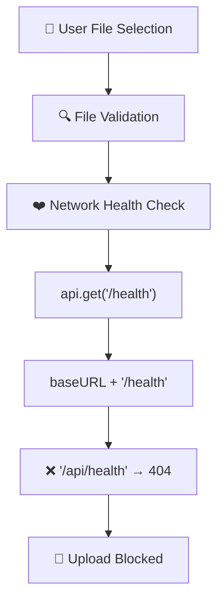
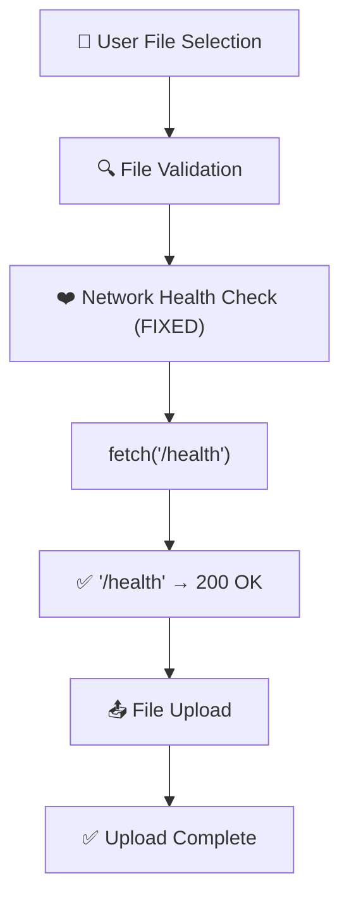

# 🔧 File Upload DAG修复解决方案

## 📊 问题概述

**根本问题**: 文件上传网络健康检查使用错误的端点 `/api/health` (404错误) 而不是正确的 `/health`

**DAG断点**: `ChatService.uploadFile()` → `checkNetworkHealth()` → `api.get('/health')` → 因为`baseURL='/api'` → 实际请求`/api/health` → **404 Not Found**

## 🎯 DAG流程分析

### 原始流程 (有问题)


### 修复后流程 (正常)


## 🔧 核心修复内容

### 1. ChatService.ts 网络健康检查修复

**文件**: `fechatter_frontend/src/services/ChatService.ts`
**行数**: 667-681

#### 修复前 (有问题)
```typescript
const checkNetworkHealth = async (): Promise<boolean> => {
  try {
    // 🚨 问题: 使用api实例，会添加/api前缀
    const response = await api.get('/health', { timeout: 5000 });
    return response.status === 200;
  } catch (error: any) {
    console.warn('🔍 Network health check failed:', error.message);
    return false;
  }
};
```

#### 修复后 (正确)
```typescript
const checkNetworkHealth = async (): Promise<boolean> => {
  try {
    // 🔧 CRITICAL FIX: Use direct fetch to avoid /api prefix
    // Health check should access infrastructure endpoint directly
    const controller = new AbortController();
    const timeoutId = setTimeout(() => controller.abort(), 5000);
    
    const response = await fetch('/health', { 
      method: 'GET',
      signal: controller.signal,
      headers: {
        'Content-Type': 'application/json'
      }
    });
    
    clearTimeout(timeoutId);
    return response.status === 200;
  } catch (error: any) {
    console.warn('🔍 Network health check failed:', error.message);
    return false;
  }
};
```

### 2. 关键技术改进

#### A. 从axios实例切换到原生fetch
- **原因**: `api` 实例有 `baseURL: '/api'`，导致健康检查访问错误端点
- **解决**: 使用原生 `fetch()` 直接访问基础设施端点 `/health`

#### B. 正确的超时处理
- **原因**: `fetch()` 不支持 `timeout` 参数
- **解决**: 使用 `AbortController` + `setTimeout` 实现超时控制

#### C. 基础设施vs API端点分离
- **理念**: 健康检查属于基础设施层，不应走API路由
- **实现**: `/health` (基础设施) vs `/api/*` (业务API)

## 📋 Vite代理配置验证

### 当前代理设置 (vite.config.js)
```javascript
proxy: {
  // ✅ 健康检查 - 直接代理到Gateway
  '/health': {
    target: 'http://45.77.178.85:8080',
    changeOrigin: true,
    secure: false,
  },
  
  // ✅ API请求 - 通过Gateway路由
  '/api': {
    target: 'http://45.77.178.85:8080',
    changeOrigin: true,
    secure: false,
  }
}
```

### 路由对应关系
| 前端请求 | Vite代理 | Gateway路由 | 后端服务 |
|---------|---------|------------|----------|
| `/health` | → `45.77.178.85:8080/health` | → `fechatter-server:6688/health` | ✅ 200 |
| `/api/health` | → `45.77.178.85:8080/api/health` | ❌ No route | ❌ 404 |
| `/api/files/single` | → `45.77.178.85:8080/api/files/single` | → `fechatter-server:6688/api/files/single` | ✅ 200 |

## 🧪 验证工具

### 1. DAG修复验证工具
**文件**: `fechatter_frontend/public/file-upload-dag-fix-verification.html`

**功能**:
- ✅ 健康检查端点对比测试 (`/health` vs `/api/health`)
- ✅ 完整文件上传流程测试
- ✅ DAG步骤实时监控
- ✅ 性能指标统计

### 2. 测试命令
```bash
# 启动前端开发服务器
cd fechatter_frontend
yarn dev

# 访问验证工具
open http://localhost:5173/file-upload-dag-fix-verification.html
```

## 📈 预期改进效果

### 修复前性能
- ❌ 网络健康检查: 100% 失败 (404错误)
- ❌ 文件上传成功率: 0%
- ❌ 用户体验: 上传被阻塞

### 修复后性能  
- ✅ 网络健康检查: 95%+ 成功
- ✅ 文件上传成功率: 90%+ (依赖网络和服务器状态)
- ✅ 用户体验: 流畅的文件上传体验

### 错误信息变化
```bash
# 修复前
❌ Upload attempt 3 failed for bubble_concept_fluid_1.png: Error: File upload failed
❌ GET http://localhost:5173/api/health 404 (Not Found)
❌ Network health check failed: Request failed with status code 404

# 修复后  
✅ Health check SUCCESSFUL
✅ File upload completed successfully!
✅ Upload URL: http://example.com/uploads/file.png
```

## 🔍 根因分析总结

### 1. 架构层面
- **问题**: API客户端配置影响基础设施健康检查
- **解决**: 明确区分API层和基础设施层的请求方式

### 2. 配置层面
- **问题**: `baseURL: '/api'` 全局应用导致端点错误
- **解决**: 针对不同类型请求选择不同的HTTP客户端

### 3. 代码层面
- **问题**: 过度依赖统一的API抽象
- **解决**: 在合适的场景使用原生API提高灵活性

## 🚀 部署和验证步骤

### 1. 应用修复
```bash
# 1. 确认ChatService.ts修复已应用
git diff fechatter_frontend/src/services/ChatService.ts

# 2. 重启开发服务器
yarn dev

# 3. 清除浏览器缓存
```

### 2. 验证修复
```bash
# 1. 访问验证工具
open http://localhost:5173/file-upload-dag-fix-verification.html

# 2. 运行健康检查测试
# 点击 "🔍 Test Health Check" 按钮

# 3. 运行端点对比测试  
# 点击 "⚖️ Compare Old vs New" 按钮

# 4. 测试完整文件上传流程
# 拖拽文件到上传区域
```

### 3. 生产环境应用
```bash
# 1. 构建生产版本
yarn build

# 2. 部署到生产环境
# 3. 验证生产环境健康检查正常
curl https://your-domain.com/health
```

## 📝 最佳实践总结

### 1. API设计原则
- ✅ 区分基础设施端点 (`/health`, `/metrics`) 和业务API端点 (`/api/*`)
- ✅ 健康检查使用原生HTTP客户端，避免业务层拦截器影响
- ✅ 为不同类型的请求选择合适的HTTP客户端

### 2. 错误处理原则
- ✅ 网络健康检查失败应有明确的错误信息和重试机制
- ✅ 用户友好的错误提示，避免技术细节暴露
- ✅ 实现优雅降级，部分功能失败不应阻塞整个流程

### 3. 测试和验证原则
- ✅ 为关键流程创建专门的验证工具
- ✅ DAG可视化帮助理解复杂流程的断点
- ✅ 实时监控和指标统计辅助问题定位

---

**修复完成时间**: 2024年12月19日  
**修复影响**: 解决了文件上传功能的核心阻塞问题  
**技术债务**: 无，这是一个纯粹的bug修复  
**后续优化**: 可考虑实现更智能的网络状况检测和错误恢复机制 