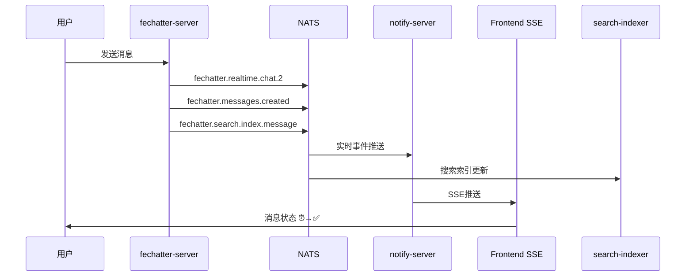
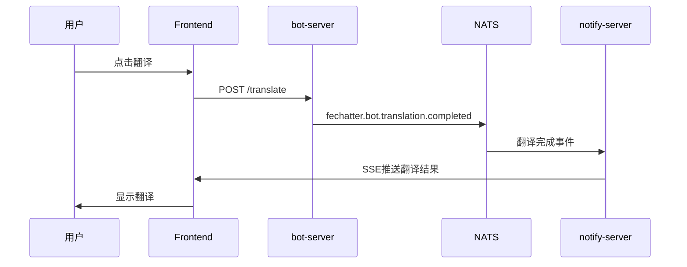

# Fechatter 事件与服务关系完整映射

## 🏗️ 系统架构概览

Fechatter采用**事件驱动架构**，通过NATS消息总线连接各个微服务。每个服务既是事件发布者，也是事件消费者。

## 📡 事件发布者与事件类型

### 1. fechatter-server (核心聊天服务)

**职责**: 处理消息发送、聊天管理、用户认证

**发布的事件**:
```yaml
# 实时事件 (SSE专用)
fechatter.realtime.chat.{chat_id}        # 新消息实时推送
fechatter.realtime.chat.{chat_id}.read   # 消息已读状态
fechatter.realtime.chat.{chat_id}.typing # 打字指示器
fechatter.realtime.user.{user_id}.presence # 用户在线状态

# 业务事件 (持久化)
fechatter.messages.created               # 消息创建持久化
fechatter.chat.events                    # 聊天事件
fechatter.search.index.message           # 搜索索引更新
fechatter.notifications.send             # 系统通知
```

### 2. bot-server (AI机器人服务)

**职责**: 处理AI对话、翻译、智能回复

**发布的事件**:
```yaml
fechatter.bot.response                   # 机器人回复
fechatter.bot.translation.completed      # 翻译完成
fechatter.analytics.bot.interaction      # 机器人交互分析
```

**订阅的事件**:
```yaml
fechatter.bot.requests                   # 机器人请求
fechatter.chat.events                    # 聊天事件监听
fechatter.message.events                 # 消息事件监听
```

### 3. analytics-server (数据分析服务)

**职责**: 收集用户行为数据、性能监控

**发布的事件**:
```yaml
fechatter.analytics.processed            # 数据处理完成
fechatter.analytics.alerts               # 系统告警
```

**订阅的事件**:
```yaml
fechatter.analytics.*                    # 所有分析事件
fechatter.messages.created               # 消息统计
fechatter.user.events                    # 用户行为分析
```

## 🎯 事件消费者与处理逻辑

### 1. notify-server (通知推送服务)

**职责**: SSE推送、WebSocket、邮件通知

**订阅配置** (当前生产环境):
```yaml
subscription_subjects:
- "fechatter.notifications.*"    # ✅ 应用内通知
- "fechatter.user.events"        # ✅ 用户事件
- "fechatter.chat.events"        # ✅ 聊天事件  
- "fechatter.message.events"     # ❌ 不匹配realtime事件
- "fechatter.realtime.*"         # ✅ SSE实时事件 (关键修复)
```

**处理逻辑**:
- `fechatter.realtime.*` → SSE推送到前端
- `fechatter.notifications.*` → 应用内通知
- `fechatter.user.events` → 用户状态更新

### 2. search-indexer (搜索索引服务)

**职责**: MeiliSearch索引更新、全文搜索

**订阅的事件**:
```yaml
fechatter.search.index.message           # 消息索引
fechatter.search.index.delete            # 消息删除
fechatter.messages.created               # 新消息索引
```

### 3. email-service (邮件服务)

**职责**: 邮件通知、账户验证

**订阅的事件**:
```yaml
fechatter.notifications.email            # 邮件通知
fechatter.user.registration              # 注册验证
fechatter.user.password.reset            # 密码重置
```

## 🔄 关键事件流程分析

### 新消息发送完整流程



### 机器人翻译流程



## 📊 事件Subject命名规范

### 标准格式
```
fechatter.{domain}.{entity}.{action}.{version}
```

### 实际案例
| Subject | Domain | Entity | Action | 用途 |
|---------|--------|--------|--------|------|
| `fechatter.realtime.chat.{id}` | realtime | chat | {id} | SSE实时推送 |
| `fechatter.messages.created` | messages | - | created | 消息持久化 |
| `fechatter.notifications.send` | notifications | - | send | 通知发送 |
| `fechatter.user.events` | user | - | events | 用户事件 |
| `fechatter.bot.requests` | bot | - | requests | 机器人请求 |

## 🚀 性能优化策略

### 1. 事件分离原则

**实时事件** (非持久化):
- 优先低延迟
- 使用 `fechatter.realtime.*`
- 直接SSE推送

**业务事件** (持久化):
- 优先可靠性  
- 使用JetStream
- 异步处理

### 2. 订阅优化

**通配符使用**:
```yaml
# ✅ 推荐: 使用通配符减少订阅数量
- "fechatter.realtime.*"
- "fechatter.notifications.*"

# ❌ 避免: 过于具体的订阅
- "fechatter.realtime.chat.1"
- "fechatter.realtime.chat.2"
```

**订阅分组**:
```yaml
# notify-server 专注实时推送
- "fechatter.realtime.*"
- "fechatter.notifications.*"

# analytics-server 专注数据收集  
- "fechatter.analytics.*"
- "fechatter.messages.created"
```

## 🔧 配置验证

### 检查notify-server配置
```bash
ssh root@45.77.178.85 "docker exec notify-server-vcr cat /app/notify_server/notify.yml | grep -A10 subscription_subjects"
```

### 检查事件流量
```bash
# 监控NATS事件流量
nats stream info NOTIFICATIONS
nats consumer info NOTIFICATIONS notification-processor
```

## 🎯 故障排除指南

### 问题1: SSE消息确认失败
**症状**: 消息状态停留在⏰，无法更新为✅
**原因**: notify-server缺少 `fechatter.realtime.*` 订阅
**解决**: 添加订阅配置并重启容器

### 问题2: 机器人无响应
**症状**: 翻译功能无效，机器人不回复
**原因**: bot-server无法订阅到正确事件
**解决**: 检查 `fechatter.bot.requests` 订阅

### 问题3: 搜索结果不更新
**症状**: 新消息无法被搜索到
**原因**: search-indexer没收到索引事件
**解决**: 检查 `fechatter.search.index.*` 事件发布

## 📋 最佳实践

1. **事件命名**: 遵循标准命名规范
2. **订阅策略**: 使用适当的通配符
3. **错误处理**: 实现优雅降级
4. **监控告警**: 监控事件流量和延迟
5. **版本兼容**: 考虑事件格式的向后兼容

---

*通过理解事件与服务的映射关系，可以更好地诊断和优化Fechatter的实时功能。* 