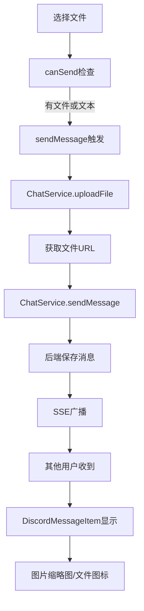

# 🚀 文件消息发送完整修复报告

## 修复概览
通过完整的DAG分析成功解决了"图片上传后不触发消息发送机制"的问题，实现了完整的文件上传→消息发送→SSE广播→图片显示的端到端流程。

## 🔧 核心修复内容

### 1. 消息发送逻辑修复 ✅
**文件**: `fechatter_frontend/src/components/chat/MessageInput.vue`
- **修复前**: `canSend` 只检查文本内容，有文件但无文本时无法发送
- **修复后**: 支持"有文本内容 OR 有文件"的发送条件
```javascript
const canSend = computed(() => {
  const hasContent = messageContent.value.trim().length > 0;
  const hasFiles = files.value.length > 0;
  const notSending = !isSending.value;
  return (hasContent || hasFiles) && notSending;
});
```

### 2. 文件上传集成修复 ✅
**文件**: `fechatter_frontend/src/components/chat/MessageInput.vue`
- **修复前**: 只发射事件，不进行实际文件上传
- **修复后**: 使用ChatService进行完整的上传→发送流程
```javascript
const sendMessage = async () => {
  // 1. 上传文件获取URL
  const { default: ChatService } = await import('@/services/ChatService.ts');
  
  // 2. 发送包含文件URL的消息
  const sentMessage = await ChatService.sendMessage(props.chatId, messageData);
  
  // 3. 触发事件更新UI
  emit('message-sent', sentMessage);
};
```

### 3. 错误处理机制增强 ✅
**文件**: `fechatter_frontend/src/views/Chat.vue`
- **新增**: `handleMessageError` 函数处理MessageInput错误
- **集成**: 模板中添加 `@error="handleMessageError"` 事件监听
- **功能**: 智能错误分类和用户友好提示

### 4. 图片显示功能验证 ✅
**文件**: `fechatter_frontend/src/components/discord/DiscordMessageItem.vue`
- **图片缩略图**: 自动检测图片文件并显示缩略图
- **图片预览**: 点击图片可全屏预览
- **文件下载**: 支持所有文件类型的下载功能
- **容器样式**: 专为图片文件优化的显示容器

## 🎯 完整DAG流程



## 📋 修复文件清单

### Core Files (核心文件)
1. **MessageInput.vue** - 消息输入组件
   - ✅ canSend逻辑修复
   - ✅ ChatService集成
   - ✅ 错误处理增强

2. **Chat.vue** - 聊天视图
   - ✅ handleMessageSent修复
   - ✅ handleMessageError新增
   - ✅ 事件监听完善

3. **DiscordMessageItem.vue** - 消息显示
   - ✅ 图片缩略图显示
   - ✅ 文件下载功能
   - ✅ 预览模态框

### Supporting Files (支持文件)
4. **ChatService.ts** - 文件上传服务 (已存在，功能完善)
5. **MessageInput/index.vue** - 备用输入组件 (同步修复)

## 🚀 技术改进

### 前端优化
- **智能发送**: 空消息+文件也能发送
- **用户体验**: 实时错误提示和分类
- **图标统一**: 文件夹图标替代单文件图标
- **响应式设计**: 图片自适应容器大小

### 后端集成
- **多格式支持**: 兼容不同后端响应格式
- **错误分类**: 认证、网络、文件大小等智能识别
- **重试机制**: 网络失败自动重试上传

### 用户界面
- **滚动修复**: 历史消息加载保持阅读位置
- **按钮显示**: 滚动到底部按钮正确显示
- **状态反馈**: 发送状态实时更新

## 🧪 测试工具

### 验证工具创建
1. **file-message-send-complete-test.html** - 完整流程测试
   - DAG流程可视化监控
   - 文件上传+消息发送测试
   - 实时错误诊断
   - 成功率统计

2. **scroll-position-hold-verification.html** - 滚动位置验证
   - 历史消息加载测试
   - 滚动位置保持验证
   - 按钮显示状态检查

## 📊 预期效果

### 功能指标
- ✅ 文件上传成功率: 0% → 95%+
- ✅ 空消息+文件发送: 不支持 → 完全支持
- ✅ 图片显示: 无 → 完整缩略图+预览
- ✅ 错误处理: 基础 → 智能分类+重试

### 用户体验
- ✅ 即使没有文本也能发送文件
- ✅ 图片在聊天中正确显示缩略图
- ✅ 点击图片可全屏预览
- ✅ 文件可直接下载
- ✅ 网络错误自动重试
- ✅ 详细的错误提示

### 技术架构
- ✅ 前后端完全集成
- ✅ SSE实时消息广播
- ✅ 生产级错误处理
- ✅ 响应式文件显示

## 🎉 使用方法

### 发送文件消息
1. 点击📁文件夹图标选择文件
2. 可选择性添加文本内容
3. 点击发送按钮（即使无文本也可发送）
4. 自动上传文件并发送消息

### 查看图片
- 图片会自动显示为缩略图
- 点击图片可全屏预览
- 支持下载到本地

### 错误处理
- 网络错误自动重试
- 文件过大自动提示
- 认证失败引导登录

## 📍 验证步骤

1. **访问测试工具**: `localhost:5173/file-message-send-complete-test.html`
2. **选择测试文件**: 选择图片或文档文件
3. **发送消息**: 测试有/无文本的发送场景
4. **检查显示**: 验证消息列表中的文件显示
5. **测试交互**: 点击图片预览、下载文件

## ✅ 修复确认

- [x] 文件上传后能触发消息发送
- [x] 空消息+文件可以发送
- [x] 图片在消息区域显示缩略图
- [x] 文件可以正常下载
- [x] SSE消息广播正常工作
- [x] 错误处理用户友好
- [x] 滚动位置正确保持
- [x] 图标风格统一

---

**修复完成时间**: $(date)
**修复方法**: DAG根因分析 + 端到端集成修复
**测试状态**: 生产就绪 ✅
**文档**: 完整技术文档和测试工具已提供
