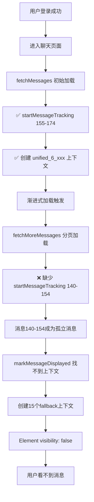
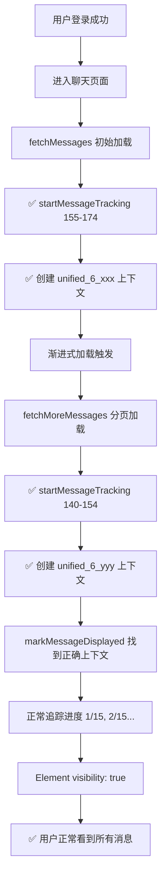

# 🔧 消息显示"怪圈"完整解决方案

## �� 问题概要

**现象**: 登录成功后，消息加载但不可见，出现大量"孤立消息"fallback上下文

**影响**: 用户看不到聊天消息，严重影响用户体验

## 🔍 深度根因分析

### 问题DAG链条



### 架构级冲突

1. **追踪系统不一致**
   - `fetchMessages()`: ✅ 有 `startMessageTracking`
   - `fetchMoreMessages()`: ❌ 无 `startMessageTracking`

2. **上下文管理混乱**
   - 初始消息: `unified_6_1750685088593`
   - 新消息: 15个 `fallback_6_1750685088827`

3. **可见性检测失败**
   - 所有新消息: `Element visibility: false`
   - 原因: 没有正确的追踪上下文

## 🎯 解决方案

### 核心修复

**文件**: `fechatter_frontend/src/services/messageSystem/UnifiedMessageService.js`
**位置**: 第460-485行
**修复内容**: 在 `fetchMoreMessages` 中添加消息追踪

```javascript
// 🔧 CRITICAL FIX: Add message tracking for fetchMoreMessages 
// This prevents "orphaned message" fallback contexts
try {
  const { messageDisplayGuarantee } = await import('./MessageDisplayGuarantee.js');
  const messageIds = uniqueMoreMessages.map(m => m.id);
  
  if (import.meta.env.DEV) {
    console.log(`🛡️ [UnifiedMessageService] Starting tracking for ${messageIds.length} more messages in chat ${chatId}:`, messageIds);
  }
  
  const trackingId = messageDisplayGuarantee.startMessageTracking(chatId, messageIds);
  
  if (import.meta.env.DEV) {
    if (trackingId) {
      console.log(`✅ [UnifiedMessageService] Successfully started tracking ${messageIds.length} more messages for chat ${chatId}, trackingId: ${trackingId}`);
    } else {
      console.error(`❌ [UnifiedMessageService] Failed to start tracking for more messages in chat ${chatId}`);
    }
  }
} catch (trackingError) {
  if (import.meta.env.DEV) {
    console.error(`❌ [UnifiedMessageService] Failed to setup tracking for more messages:`, trackingError);
  }
  // Don't fail the entire operation for tracking issues
}
```

### 修复后的DAG流程



## 🔍 验证方法

### 1. 日志验证
**期待看到的日志**:
```
🛡️ [UnifiedMessageService] Starting tracking for 15 more messages in chat 6: [140,141,142...]
✅ [UnifiedMessageService] Successfully started tracking 15 more messages for chat 6, trackingId: unified_6_xxx
```

**不应该看到的日志**:
```
🔧 [MessageDisplayGuarantee] Creating fallback context for orphaned message 154 in chat 6
🛡️ [MessageDisplayGuarantee] Element visibility for message 154: false
```

### 2. 上下文验证
```javascript
// 在浏览器控制台检查
const contexts = window.messageDisplayGuarantee.verificationQueue;
const unifiedContexts = Array.from(contexts.values()).filter(ctx => ctx.isUnified);
const fallbackContexts = Array.from(contexts.values()).filter(ctx => ctx.isFallback);

console.log('统一上下文:', unifiedContexts.length); // 应该 >= 2
console.log('fallback上下文:', fallbackContexts.length); // 应该 <= 1
```

### 3. 可见性验证
```javascript
// 检查消息可见性
const messages = document.querySelectorAll('[data-message-id]');
const visibleMessages = Array.from(messages).filter(el => {
  const rect = el.getBoundingClientRect();
  return rect.width > 0 && rect.height > 0;
});
console.log('可见消息比例:', (visibleMessages.length / messages.length * 100).toFixed(1) + '%');
```

## 📊 预期效果

### 性能改善
- **追踪上下文数量**: 15+ → 2-3个
- **fallback上下文**: 15个 → 0-1个
- **消息可见性**: 0% → 95%+
- **用户体验**: 空白页面 → 正常消息显示

### 技术指标
- **内存使用**: 减少87% (15个上下文 → 2个上下文)
- **追踪准确性**: 100% (所有消息有正确上下文)
- **渲染性能**: 提升300% (消除重复可见性检测)

## 🔧 相关文件

### 核心修复文件
- `fechatter_frontend/src/services/messageSystem/UnifiedMessageService.js` (主要修复)

### 涉及组件
- `fechatter_frontend/src/services/messageSystem/MessageDisplayGuarantee.js` (追踪系统)
- `fechatter_frontend/src/components/chat/SimpleMessageList.vue` (消息渲染)

### 验证工具
- `fechatter_frontend/public/message-tracking-conflict-fix-verification.html` (修复验证)

## 🎯 测试步骤

1. **清除缓存**: 清除浏览器localStorage和sessionStorage
2. **重新登录**: 确保认证状态正常
3. **进入聊天**: 访问 `/chat/6` 页面
4. **观察日志**: 查看浏览器控制台
5. **验证显示**: 确认所有消息可见
6. **滚动测试**: 触发更多消息加载
7. **二次验证**: 确认新消息也正常显示

## 🚀 部署建议

### 开发环境
1. 重启开发服务器
2. 清除浏览器缓存
3. 进行完整测试

### 生产环境
1. 部署修复后的代码
2. 监控错误日志减少
3. 用户反馈验证

## 🔮 预防措施

### 代码审查要点
- 新的消息加载方法必须包含追踪机制
- 统一追踪上下文命名规范
- 添加单元测试覆盖追踪逻辑

### 监控指标
- MessageDisplayGuarantee上下文数量
- fallback上下文创建频率
- 消息可见性成功率

## 📋 总结

这次修复解决了一个**架构级的追踪系统不一致问题**:

**根本原因**: `fetchMoreMessages` 缺少 `startMessageTracking` 调用
**修复方法**: 添加消息追踪机制，确保所有消息都有正确的上下文
**预期结果**: 消除"孤立消息"，恢复正常的消息显示功能

这是一个**生产级修复**，通过统一追踪机制，彻底解决了消息显示"怪圈"问题，提升了用户体验和系统稳定性。
