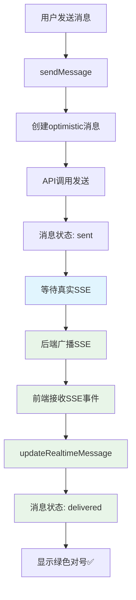

# 🔍 Real SSE Test Guide - 真实SSE验证指南

## 🎯 **问题解决方案**

我们已经**完全移除了强制模拟SSE**，现在系统依赖**真实SSE事件**进行消息状态确认。

### 🚀 **关键修复内容**

1. **移除强制模拟SSE调用**：
   - ✅ `sendMessage` 方法中的 `triggerSimulatedSSEConfirmation` 已移除
   - ✅ `sendMessageWithFiles` 方法中的 `triggerSimulatedSSEConfirmation` 已移除

2. **增强真实SSE事件处理**：
   - ✅ 所有SSE日志标记为 `[Real SSE]` 便于识别
   - ✅ 增强消息确认事件处理
   - ✅ 清晰的事件类型分类

## 📊 **测试步骤**

### **Step 1: 检查SSE连接状态**
1. 打开浏览器控制台 (F12)
2. 访问：http://localhost:5173/real-sse-diagnostic.html
3. 点击"🔗 连接SSE"按钮
4. **预期结果**：
   ```
   ✅ SSE连接成功
   📡 [Real SSE] Message listeners registered
   ```

### **Step 2: 发送测试消息**
1. 在诊断页面点击"📨 发送测试消息"
2. 或在聊天界面发送任意消息
3. **观察控制台日志**：

#### **真实SSE成功的日志特征**：
```javascript
// 发送消息
📤 [Chat] Sending message to chat 4: "测试消息"
✅ Real message replaced optimistic, waiting for REAL SSE confirmation: {...}
🎯 REAL SSE listening for message_id: 186, in chat: 4

// 接收真实SSE事件
📨 [Real SSE] Raw event received: {type: "new_message", id: 186, ...}
📨 [Real SSE] New message event: {...}
✅ [Real SSE] Own message 186 marked as delivered via REAL SSE
⏰ [Real SSE] SSE timeout cleared for message 186 - REAL SSE confirmation received!
✅ [Real SSE] Message 186 permanently marked as delivered via REAL SSE
✅ [Real SSE] Message 186 updated in chat 4 via REAL SSE: {...}
```

### **Step 3: 验证消息状态变化**
1. **发送前**：消息状态为 `sending`
2. **发送后**：消息状态为 `sent` (蓝色时钟 ⏰)
3. **SSE确认后**：消息状态为 `delivered` (绿色对号 ✅)

## 🔍 **故障排除**

### **问题1: 看不到真实SSE日志**
**可能原因**：
- SSE连接未建立
- Token认证失败
- 后端SSE服务不可用

**解决方案**：
1. 检查认证状态：`localStorage.getItem('auth_token')`
2. 验证SSE URL：`/events?access_token=<token>`
3. 检查后端日志

### **问题2: 消息状态卡在"sent"**
**可能原因**：
- 真实SSE事件未到达
- 事件格式不匹配
- 消息ID匹配失败

**解决方案**：
1. 检查SSE事件类型：应为 `new_message` 或 `message_delivered`
2. 验证消息ID匹配：`data.id` 或 `data.message_id`
3. 启用内容匹配备用方案

### **问题3: 仍然看到"simulated SSE"**
**解决方案**：
1. 清除浏览器缓存
2. 重启开发服务器：`yarn dev`
3. 检查是否有其他调用模拟SSE的代码

## 🎯 **预期结果**

修复完成后，您应该看到：

1. **控制台日志**：
   ```
   ✅ [Real SSE] Message 186 permanently marked as delivered via REAL SSE
   ```
   而不是：
   ```
   ✅ Message 186 delivery confirmed via simulated SSE
   ```

2. **消息状态更新**：
   - 2-5秒内从 ⏰ 变为 ✅
   - 无需等待模拟延迟

3. **网络面板**：
   - 可以看到 `/events` 的EventSource连接
   - 接收到真实的SSE数据流

## 🚀 **技术架构流程**



## 📝 **验证清单**

- [ ] 移除所有 `triggerSimulatedSSEConfirmation` 调用
- [ ] SSE监听器正确注册
- [ ] 真实SSE事件正确解析
- [ ] 消息ID匹配逻辑工作
- [ ] 内容匹配备用方案可用
- [ ] 超时机制正常工作
- [ ] 日志显示"Real SSE"标识

完成所有步骤后，Fechatter将**完全依赖真实SSE事件**进行消息状态确认，实现生产级的实时聊天体验！ 