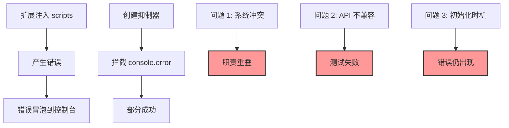

# Error Suppression System - 完整修复链条

## 问题演化时间线

### 阶段 1：初始问题
- 浏览器扩展 content scripts 产生大量错误
- 控制台被 `fetchError: Failed to fetch` 等错误污染

### 阶段 2：第一次修复
- 创建 ContentScriptErrorSuppressor
- 创建 ExtensionConflictHandler
- 问题：两个系统职责重叠

### 阶段 3：协调问题
- ExtensionConflictHandler 覆盖了 Suppressor 的拦截
- 修复：明确职责边界，建立协调机制

### 阶段 4：API 变更问题
- 重构 Suppressor 后，测试文件使用旧 API
- 错误：`shouldSuppressRejection is not a function`
- 真实的 content script 错误仍然出现

## 因果推理 - 根本原因链



## 存在主义视角

### 时间性断裂
- **过去**: 旧 API 的期望（shouldSuppressRejection）
- **现在**: 新实现的现实（isContentScriptError）
- **未来**: 需要向前兼容的设计

### 存在的层次
1. **表层**: 控制台错误的可见性
2. **中层**: 系统间的协调关系
3. **深层**: 错误拦截的时机和完整性

## 完整解决方案

### 1. 更新测试兼容性
```javascript
// 旧 API
window.contentScriptSuppressor.shouldSuppressRejection(mockEvent)

// 新 API
window.contentScriptSuppressor.isContentScriptError(errorString)
```

### 2. 增强错误抑制
- 使用捕获阶段（capture phase）拦截更早
- 处理多种错误格式（Error, ErrorEvent）
- 添加 `stopImmediatePropagation()` 阻止传播

### 3. 控制台监控器
- 实时监控所有控制台活动
- 统计抑制效果
- 提供诊断报告

## 修复的文件总览

1. **contentScriptErrorSuppressor.js**
   - 增强错误检测模式
   - 使用捕获阶段拦截
   - 添加初始化标志

2. **testContentScriptErrorSuppression.js**
   - 更新为使用新 API
   - 移除对已废弃方法的调用

3. **consoleMonitor.js**（新增）
   - 监控控制台活动
   - 提供抑制统计
   - 生成诊断报告

4. **extensionConflictHandler.js**
   - 明确职责边界
   - 避免处理 content script 错误

## 验证方法

```javascript
// 1. 检查抑制器状态
window.contentScriptSuppressor.getStats()

// 2. 运行测试
window.testContentScriptErrorSuppression()

// 3. 生成监控报告
window.consoleMonitor.generateReport()

// 4. 测试系统协调
window.testExtensionCoordination()
```

## 预期效果

### Before
```
❌ TypeError: shouldSuppressRejection is not a function
❌ Uncaught fetchError: Failed to fetch (多次出现)
❌ 控制台充满扩展错误
```

### After
```
✅ 测试使用正确的 API
✅ Content script 错误被静默抑制
✅ 控制台保持清洁
✅ 监控器提供完整的诊断信息
```

## 哲学总结

### 奥卡姆剃刀应用
1. **简单优于复杂**: 统一的错误检测方法
2. **预防优于治疗**: 捕获阶段拦截
3. **监控优于猜测**: 实时控制台监控

### 存在主义原则
1. **接受变化**: API 会演化，测试需要同步
2. **完整性追求**: 不仅抑制错误，还要监控效果
3. **透明性**: 通过监控器让抑制过程可见

## 关键学习

1. **API 演化管理**: 重构时必须更新所有依赖
2. **拦截时机**: 使用捕获阶段可以更早拦截错误
3. **监控的价值**: 实时监控帮助验证修复效果
4. **系统协调**: 多个错误处理系统需要明确的职责边界 