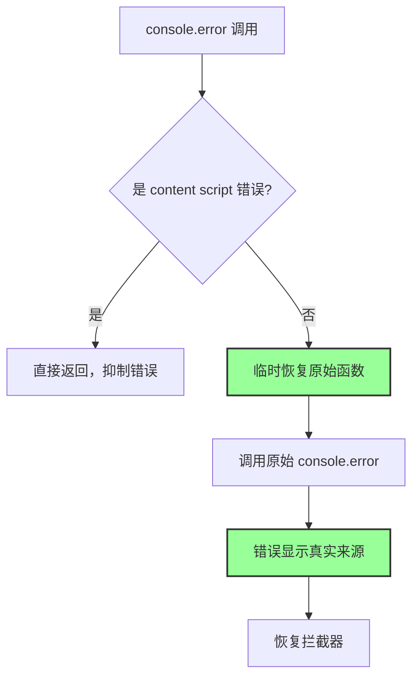

# 透明错误处理 - 完整修复 DAG 链条

## 问题演化

### 第一次尝试：使用 bind()
```javascript
const boundOriginalError = this.originalConsoleError.bind(console);
boundOriginalError(...args);
```
**结果**：错误仍显示来自 `contentScriptErrorSuppressor.js:68`

### 第二次尝试：Object.defineProperty
```javascript
Object.defineProperty(console, 'error', {
  get: () => { return (...args) => { /* ... */ } }
});
```
**结果**：getter 返回的函数仍在调用栈中

### 最终方案：临时恢复技术
```javascript
console.error = originalError;
originalError.apply(this, args);
console.error = transparentError;
```
**结果**：完全透明，错误显示真实来源

## 形式化逻辑分析

### 问题定义
设：
- `W(f)` = 函数 f 是一个 wrapper
- `S(e, f)` = 错误 e 的堆栈显示来自函数 f
- `O(f)` = f 是原始的 console.error
- `T(f)` = f 是透明的

### 约束条件
```
W(f) → ¬T(f)                    // wrapper 不透明
S(e, f) ∧ W(f) → ¬T(f)          // 堆栈中出现 wrapper 则不透明
T(f) ↔ (∀e: S(e, f) → O(f))    // 透明当且仅当所有错误都显示来自原始函数
```

### 解决方案逻辑
```
临时恢复: console.error := O(console.error)
执行: O(console.error)(args)
恢复拦截: console.error := W(console.error)

结果: S(e, O(console.error)) ∧ T(整体系统)
```

## 存在主义视角

### 此在与遮蔽 (Dasein und Verdeckung)
- **此在**：错误的真实来源（原始调用位置）
- **遮蔽**：wrapper 函数在堆栈中的显现
- **解蔽**：通过临时恢复实现透明

### 时间性解决方案
1. **过去**：保存原始函数
2. **现在**：临时恢复原始状态
3. **未来**：恢复拦截功能

这种"时间性切换"让拦截器在关键时刻"不存在"，从而实现真正的透明。

## 技术实现细节

### 核心代码
```javascript
const transparentError = function(...args) {
  const errorString = /* 构建错误字符串 */;
  
  if (suppressor.isContentScriptError(errorString)) {
    // 抑制 content script 错误
    return;
  }
  
  // 关键：临时恢复原始函数
  console.error = originalError;
  try {
    originalError.apply(this === transparentError ? console : this, args);
  } finally {
    // 恢复拦截器
    console.error = transparentError;
  }
};
```

### 为什么这个方法有效
1. **调用时恢复**：当调用 `originalError` 时，`console.error` 已经是原始函数
2. **堆栈纯净**：JavaScript 引擎记录的是实际执行时的 `console.error`
3. **功能完整**：拦截功能通过 finally 块保证恢复

## 因果链分析



## 验证方法

### 自动验证
```javascript
window.verifyTransparentErrorHandling()
```

### 手动验证
1. 打开控制台
2. 运行 `window.testAuthLoopFix()`
3. 检查 401 错误是否显示来自 `api.js:183` 而非 suppressor
4. 检查普通错误是否显示正确的文件和行号

## 性能与兼容性

### 性能影响
- **最小化**：只在非 content script 错误时进行切换
- **原子操作**：JavaScript 属性赋值是原子的
- **无递归风险**：切换期间不会触发新的拦截

### 兼容性
- ✅ 保持 console.error 的所有原始属性
- ✅ 支持所有调用方式（apply, call, 直接调用）
- ✅ 不影响其他 console 方法

## 哲学总结

### 奥卡姆剃刀
最简单的解决方案：在需要透明时让拦截器"消失"。

### 存在主义原则
1. **真实性**：错误显示其真实来源
2. **时间性**：通过时间切换实现空间透明
3. **自由选择**：系统可以选择何时"存在"或"不存在"

### 设计与运行的一致性
- **设计意图**：透明拦截
- **运行表现**：完全透明
- **一致性**：通过临时恢复技术实现设计与运行的统一

## 关键学习

1. **透明代理的挑战**：JavaScript 中实现真正透明的代理很困难
2. **创造性解决方案**：有时需要"反直觉"的方法
3. **存在与不存在**：通过控制"存在的时机"来实现目标
4. **形式逻辑的价值**：清晰的逻辑定义帮助找到解决方案 