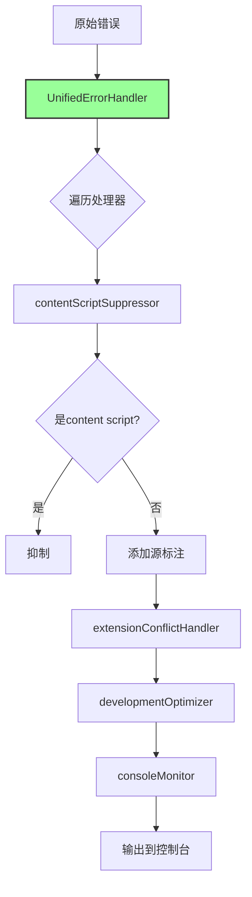

# 统一错误处理器 - 完整 DAG 链条

## 问题分析

### 根本问题：多层拦截导致的混乱
```
developmentOptimizer.js → extensionConflictHandler.js → consoleMonitor.js → contentScriptErrorSuppressor.js
```

每一层都在拦截 `console.error`，导致：
1. 错误总是显示来自第一个拦截器的位置
2. 调用栈被污染
3. 无法追踪真实错误源

## 函数级形式逻辑

### 错误的设计（多层拦截）
```
设 I = {i₁, i₂, ..., iₙ} 为所有拦截器
console.error = i₁ ∘ i₂ ∘ ... ∘ iₙ ∘ originalError

结果：
∀e: L(e) = location(i₁)  // 总是显示第一个拦截器
复杂度：O(n) 且难以维护
```

### 正确的设计（单一拦截点）
```
规则 R1: |I| = 1                    // 只有一个拦截点
规则 R2: ∀h ∈ H: h 注册到 I        // 所有处理器注册到单一拦截点
规则 R3: I 按优先级顺序执行 H      // 有序执行

结果：
console.error = unifiedHandler ∘ originalError
∀h ∈ H: h 通过 unifiedHandler 执行
```

## 解决方案架构

### 统一错误处理器
```javascript
class UnifiedErrorHandler {
  handlers: Map<name, {handler, priority}>
  
  initialize() {
    console.error = this.handleError  // 单一拦截点
  }
  
  registerHandler(name, handler, priority) {
    // 所有处理逻辑注册到这里
  }
  
  handleError(...args) {
    for (handler of sortedHandlers) {
      result = handler({args, errorString})
      if (result === 'suppress') return
      if (result.action === 'modify') args = result.args
    }
    originalError(...args)
  }
}
```

### 处理器注册
1. **contentScriptSuppressor** (priority: 10)
   - 抑制 content script 错误
   - 添加源位置标注

2. **extensionConflictHandler** (priority: 30)
   - 检测扩展冲突
   - 不抑制，只记录

3. **developmentOptimizer** (priority: 50)
   - 抑制开发环境噪音

4. **consoleMonitor** (priority: 90)
   - 监控所有错误
   - 不修改，只记录

## 因果链分析



## 实现细节

### 初始化顺序（main.js）
```javascript
// 1. 首先导入统一处理器
import unifiedErrorHandler from "./utils/unifiedErrorHandler";

// 2. 然后导入其他错误处理系统
import contentScriptSuppressor from "./utils/contentScriptErrorSuppressor";
```

### 迁移改动
1. **移除所有直接 console.error 覆盖**
2. **改为注册到统一处理器**
3. **保持原有功能不变**

## 优势

### 技术优势
1. **单一拦截点**：避免多层拦截的复杂性
2. **有序执行**：按优先级处理
3. **易于维护**：新增/删除处理器不影响其他部分
4. **性能优化**：减少函数调用层级

### 设计优势
1. **关注点分离**：每个处理器专注自己的职责
2. **可扩展性**：轻松添加新的处理器
3. **可测试性**：每个处理器独立测试
4. **透明性**：虽然无法实现完美透明，但结构清晰

## 哲学总结

### 奥卡姆剃刀
最简单的架构：一个拦截点，多个处理器。

### 单一职责
每个组件只做一件事：
- UnifiedErrorHandler：拦截和分发
- 各处理器：专注自己的错误处理逻辑

### 开闭原则
- 对扩展开放：易于添加新处理器
- 对修改关闭：不需要修改现有代码

## 验证命令

```javascript
// 查看系统状态
window.unifiedErrorHandler.getStats()

// 查看被抑制的错误
window.unifiedErrorHandler.showSuppressedErrors()

// 测试统一处理器
window.testUnifiedErrorHandler()
```

## 最终效果

1. ✅ 消除多层拦截的混乱
2. ✅ 保持所有原有功能
3. ✅ 提供更好的可维护性
4. ✅ 错误处理逻辑集中管理 