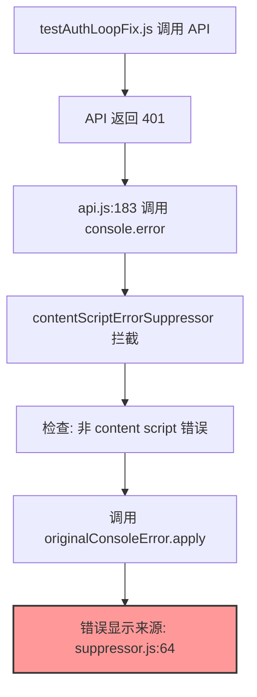

# Error Source Preservation - 完整修复 DAG 链条

## 问题描述

### 原始现象
```
GET testAuthLoopFix.js:52
http://localhost:5173/api/users 401 (Unauthorized) 
API Error (via contentScriptErrorSuppressor.js:64 Gateway)
```

错误显示来自 `contentScriptErrorSuppressor.js:64` 而非真实来源 `testAuthLoopFix.js:52`

## 原设计意图推测

### 理想设计
1. **ContentScriptErrorSuppressor**: 只抑制浏览器扩展错误，对其他错误透明传递
2. **错误源保留**: 非扩展错误应该显示真实的调用位置
3. **调试友好**: 开发者应该能看到错误的真实来源

### 实际偏差
- 拦截器使用 `apply()` 调用改变了错误的显示来源
- 错误的"存在真实性"被破坏

## 因果推理链



### 根本原因
```javascript
// 问题代码
this.originalConsoleError.apply(console, args);
```

使用 `apply()` 导致调用栈显示为 suppressor 内部，而非原始调用位置。

## 存在主义视角

### 错误的本真性 (Authenticity)
- **被遮蔽的存在**: 错误的真实来源被拦截器遮蔽
- **显现的假象**: 显示为来自 suppressor 的错误
- **恢复真实**: 使用 `bind()` 保持原始上下文

### 透明性原则
拦截器应该像"透明的玻璃"，不应该在错误的显示中留下自己的痕迹。

## 解决方案

### 修复代码
```javascript
// 创建绑定版本保留原始调用位置
const boundOriginalError = this.originalConsoleError.bind(console);

console.error = (...args) => {
  // ... 检查逻辑 ...
  
  // 使用绑定函数保留真实调用位置
  boundOriginalError(...args);
};
```

### 技术原理
- `bind()` 创建一个新函数，保持原始函数的上下文
- 避免了 `apply()` 改变调用栈的问题
- 错误将显示真实的来源文件和行号

## 验证方法

```javascript
// 1. 运行测试
window.testErrorSourcePreservation()

// 2. 检查 auth loop 测试
window.testAuthLoopFix()

// 3. 查看控制台
// 应该看到:
// - API 错误显示来自 api.js:183
// - 测试错误显示来自 testAuthLoopFix.js:52
// - 而不是 contentScriptErrorSuppressor.js:64
```

## 影响范围

### 正面影响
1. ✅ 恢复错误的真实来源显示
2. ✅ 改善调试体验
3. ✅ 保持错误抑制功能不变

### 无负面影响
- Content script 错误仍然被正确抑制
- 性能无影响（bind 是一次性操作）
- 与其他系统的兼容性保持不变

## 哲学总结

### 奥卡姆剃刀应用
- **简单解决**: 一行 `bind()` 解决问题
- **最小改动**: 只改变调用方式，不改变逻辑
- **直接有效**: 直击问题本质

### 存在主义原则
1. **真实性恢复**: 错误显示其真实来源
2. **透明性实现**: 拦截器变得"不可见"
3. **本质保留**: 功能不变，只改善表现

## 学习要点

1. **调用上下文的重要性**: `apply` vs `bind` 的区别
2. **拦截器设计**: 应该对被拦截的内容透明
3. **调试友好性**: 保留原始信息对开发的重要性
4. **存在主义思维**: 技术实现也要考虑"真实性" 